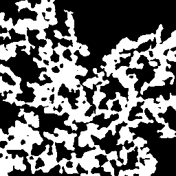
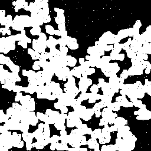

```{r, include = FALSE}
knitr::opts_chunk$set(
  collapse = TRUE,
  comment = "#>"
)
```

```{r setup}
require(monogamy)
library(dplyr)
library(ggplot2)
library(knitr)
library(mgcv)
library(tidyr)
library(purrr)
```

This example from the `mgcv` package demonstrates fitting a monotonic
GAM model with two different settings for the `k` parameter.

```{r plotfunction}
set.seed(20200410)
x <- runif(100) * 4 - 1
x <- sort(x)
f <- exp(4 * x) / (1 + exp(4 * x))
y <- f + rnorm(100) * 0.1
#par(mfrow = c(1, 2))
plot(x, y)
fv <- mspline(x, y, 5)
lines(x, predict(fv, x), col = "#7fc97f")
residfv_5 <- residuals(fv)
fv <- mspline(x, y, 10)
 lines(x, predict(fv, x), col = "#386cb0")
legend("bottomright", lty = 1, paste0("k=", c(5, 10)),
       col = c("#7fc97f", "#386cb0"))

residfv_10 <- residuals(fv)
plot(x = x, y = residfv_5, main = "Residuals vs x plot",
     col = "#7fc97f", ylab = "residual")
points(x = x, y = residfv_10, col = "#386cb0", pch = 16)
legend("bottomright", pch = c(1, 16), paste0("k=", c(5, 10)),
       col = c("#7fc97f", "#386cb0"))

```

This is an artificial data set, though, and the ground truth is that the
curve is monotonic. Here we present some real data where the relationships
between the variables are expected to be monotonic but may not be.

```{r readincatsim}
data(imagemetrics)
knitr::kable(head(imagemetrics), digits = 3)
```

Here we have, in long format, a set of image quality metrics for a
set of 180 distorted binary images. There are 12 "ground truth" images
and 15 distorted versions of them. A number of people were surveyed
for their opinion of the quality of the distorted images compared to
the baseline on a scale from 0 - 100. The mean for each image
is in the column 'mean' - designated the 'Mean Opinion Score' or MOS -
and the standard deviation of their rating
is captured in the column 'std'. We then compute a set of image
quality metrics whose scores are in 'score' and whose names are in 'metric'.




Here are two example images the respondents would have been shown:
the baseline image on the left and the distorted image on the right.
This image had a mean rating of 52.

We expect there to be a correspondence between the image quality metrics
and the MOS and that it should be monotonic, though it may be curved and
may have a lot of noise in it. The quality of the images is very low compared
to what might be typical for full color or grayscale images.

```{r plotmetrics}
metric_names <- c(
  `catsim` = "CatSIM (Cohen)",
  `msssim` = "MS-SSIM",
  `AdjRand` = "Adjusted Rand",
  `catsimrand` = "CatSIM (AdjRand)",
  `catsimacc` = "CatSIM (Accuracy)",
  `accuracy` = "Accuracy",
  `cwssim` = "CW-SSIM",
  `Cohen` = "Cohen's kappa"
)
qplot(
  x = score, y = mean, color = I("#b2df8a"), alpha = I(0.8), size = I(0.75),
  data = imagemetrics) +
  theme_bw() + geom_smooth(
    method = "gam", se = FALSE, color = "#1f78b4",
    method.args = list(method = "GCV.Cp")
    ) +
    geom_smooth(method="lm", se = FALSE, color = "#fb9a99") +
  ylab("MOS") + xlab(NULL) +
  facet_wrap(~metric, labeller = as_labeller(metric_names)) +
  theme(
    strip.background = element_rect(fill = alpha("#a6cee3", 0.3)),
    axis.text.x = element_text(angle = 45, hjust = 1)
  ) +
    NULL
```

There is a GAM model here and it's fitted by generalized cross validation,
but it has a problem: the fit really ought to be monotonic, though it's
interesting if it isn't. We should have some sense of how well a monotonic
fit works for this data and then can judge which metric best explains the
variation in MOS. We can get a sense of how well each method relates
to the MOS rating:

```{r correlation}
groupcorr <- imagemetrics %>% group_by(metric) %>%
    summarize(Spearman = cor(mean,score, method="spearman", use = "complete.obs"),
              Kendall = cor(mean, score, method="kendall", use = "complete.obs"),
              Pearson = cor(mean, score, method="pearson", use = "complete.obs")) %>%
    arrange(Spearman)

knitr::kable(groupcorr,digits=3)
```

```{r monomodels}
fit_mspline <- function(df, k = 10, lower = NA, upper = NA) {
    mspline(x = df[["score"]], y = df[["mean"]],
            k = k, lower = lower, upper = upper)
}


imagemetrics %>% group_by(metric) %>% nest() %>%
    mutate(msplinemodel = map(data, fit_mspline),
           residuals = map(msplinemodel, residuals),
           msplineSE = map_dbl(residuals, sd)) -> metricmodels

scatter_fun = function(x, y) {
     ggplot(metricmodels, aes(x = .data[[x]], y = .data[[y]]) ) +
          geom_point() +
         theme_bw()
}

par(mfrow = c(1,2))
for (i in 1:8) {
    plot(metricmodels$msplinemodel[[i]], xlab = metricmodels$metric[i],
         ylab = "MOS")
}
```
